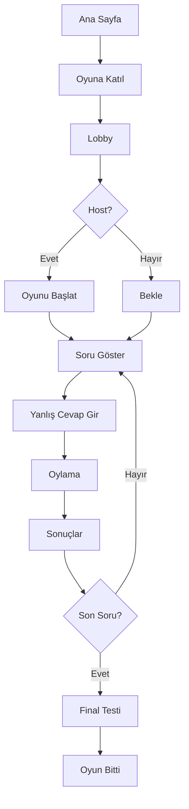

# 🎮 ÖzBilig - Eğitici Multiplayer Aldatma Oyunu

ÖzBilig, Fibbage ve Balderdash tarzı, eğlenceli ve eğitici bir multiplayer trivia oyunudur. Oyuncular yanlış ama inandırıcı cevaplar yazarak birbirlerini aldatmaya çalışır!

## 🌟 Özellikler

- 🎯 **Multiplayer:** 2-4 oyuncu aynı anda
- 🌐 **Gerçek Zamanlı:** WebSocket ile anlık senkronizasyon
- 🎨 **Modern Arayüz:** Svelte ve Tailwind CSS
- 📱 **Responsive:** Mobil ve desktop uyumlu
- 🔧 **Admin Paneli:** Kolay soru yönetimi
- 🐳 **Docker:** Kolay deployment
- 🇹🇷 **Türkçe:** Tam Türkçe dil desteği

## 🎯 Nasıl Oynanır?

1. **Katılım:** 2-4 oyuncu oyuna katılır
2. **Yanlış Cevap:** Her soru için yanlış ama inandırıcı bir cevap yaz
3. **Oylama:** Tüm cevaplar karıştırılır, doğruyu bul!
4. **Puanlama:**
   - Doğru cevap: **+1000 puan**
   - Başkalarını aldatma: **+500 puan/kişi**
5. **Final Testi:** 10 soru sonra aynı soruları tekrar cevapla (+500 puan/doğru)

## 🚀 Hızlı Başlangıç

### Development

```bash
# Repository'yi klonla
git clone <repository-url>
cd ozbilig

# Docker Compose ile başlat
docker compose up -d

# Erişim
# Oyun: http://localhost:5173
# Admin: http://localhost:5173/#admin
# API: http://localhost:8000
```

### Production

```bash
# Production build ve deploy
docker compose -f docker-compose.prod.yml up -d --build

# Erişim
# Oyun: http://sunucu-ip
# Admin: http://sunucu-ip/#admin
```

Detaylı deployment bilgisi için: [DEPLOYMENT.md](DEPLOYMENT.md)

## 🏗️ Teknoloji Stack

### Backend
- **FastAPI:** Modern, hızlı Python web framework
- **Socket.IO:** Gerçek zamanlı WebSocket iletişimi
- **SQLAlchemy:** ORM ve veritabanı yönetimi
- **SQLite:** Hafif veritabanı
- **Python 3.11+**

### Frontend
- **Svelte:** Reaktif UI framework
- **Vite:** Hızlı build tool
- **Tailwind CSS:** Utility-first CSS
- **Socket.IO Client:** WebSocket client
- **Nginx:** Production web server

### DevOps
- **Docker:** Containerization
- **Docker Compose:** Multi-container orchestration

## 📁 Proje Yapısı

```
ozbilig/
├── backend/
│   ├── app/
│   │   ├── main.py          # FastAPI uygulaması
│   │   ├── websocket.py     # Socket.IO event handlers
│   │   ├── game_manager.py  # Oyun mantığı
│   │   ├── database.py      # Veritabanı setup
│   │   └── models.py        # SQLAlchemy modelleri
│   ├── Dockerfile
│   └── requirements.txt
├── frontend/
│   ├── src/
│   │   ├── components/      # Svelte komponentleri
│   │   ├── stores/          # State management
│   │   ├── utils/           # Socket.IO manager
│   │   ├── App.svelte       # Ana uygulama
│   │   └── main.js
│   ├── Dockerfile
│   ├── Dockerfile.prod      # Production build
│   ├── nginx.conf           # Nginx config
│   └── package.json
├── docker-compose.yml       # Development
├── docker-compose.prod.yml  # Production
├── DEPLOYMENT.md
└── README.md
```

## 🎮 Oyun Akışı



## 📊 Admin Paneli

Admin panelinde yapabilecekleriniz:
- ✅ Soru ekleme/silme
- ✅ Kategori yönetimi
- ✅ Zorluk seviyesi belirleme
- ✅ Aktif soru sayısını görme

**Erişim:** `http://sunucu-ip/#admin`

## 🌐 Multiplayer Testi

### Lokal Ağda
1. Sunucu IP'nizi öğrenin: `hostname -I`
2. Diğer cihazlardan bu IP'ye bağlanın
3. Her oyuncu farklı isimle katılsın

### İnternet Üzerinden
1. Router'da port 80'i yönlendirin
2. Dış IP adresinizi öğrenin
3. Firewall'da port 80'i açın
4. Dış IP ile erişim sağlayın

## 🔧 Geliştirme

### Backend Development
```bash
cd backend
pip install -r requirements.txt
uvicorn app.main:app --reload
```

### Frontend Development
```bash
cd frontend
npm install
npm run dev
```

### Database Yönetimi
```bash
# Veritabanını sıfırla
docker compose down -v
docker compose up -d

# Veritabanını yedekle
docker run --rm -v ozbilig_backend-db:/data -v $(pwd):/backup alpine tar czf /backup/backup.tar.gz -C /data .
```

## 🐛 Troubleshooting

### Container Başlamıyor
```bash
docker compose ps
docker compose logs
```

### WebSocket Bağlanamıyor
- Firewall kontrolü
- Browser console logları
- Nginx config kontrolü

### Sorular Yüklenmiyor
```bash
curl http://localhost:8000/api/questions
docker volume ls | grep ozbilig
```

## 🤝 Katkıda Bulunma

1. Fork edin
2. Feature branch oluşturun (`git checkout -b feature/amazing`)
3. Commit edin (`git commit -m 'Add amazing feature'`)
4. Push edin (`git push origin feature/amazing`)
5. Pull Request açın

## 📝 Lisans

Bu proje [MIT Lisansı](LICENSE) altında lisanslanmıştır.

## 🙏 Teşekkürler

- Fibbage/Balderdash oyunlarından ilham alınmıştır
- FastAPI, Svelte, ve Socket.IO topluluklarına teşekkürler

## 📞 İletişim

Sorularınız için issue açabilirsiniz.

---

**ÖzBilig ile eğlenceli öğrenme! 🎓🎮**
